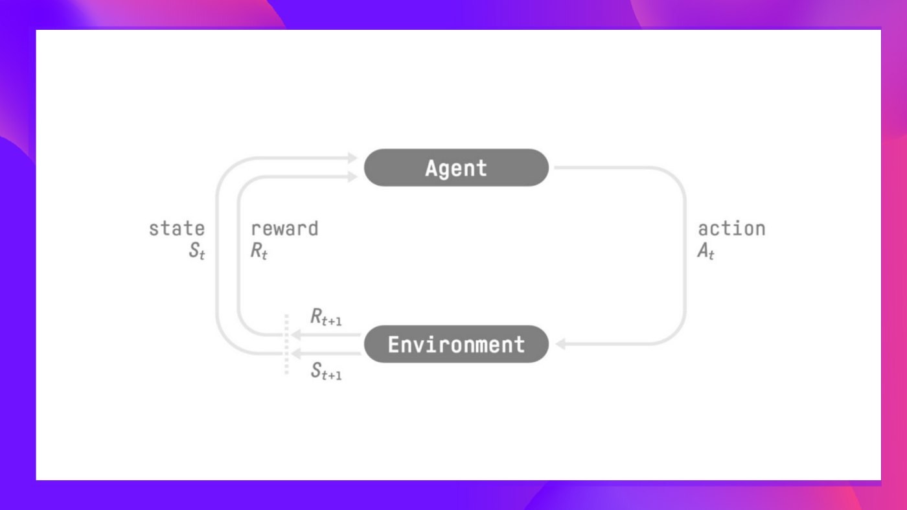
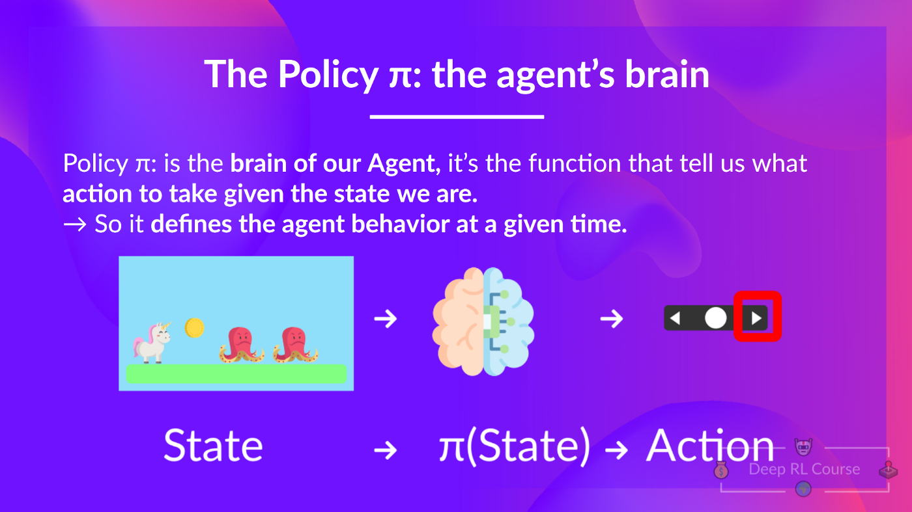
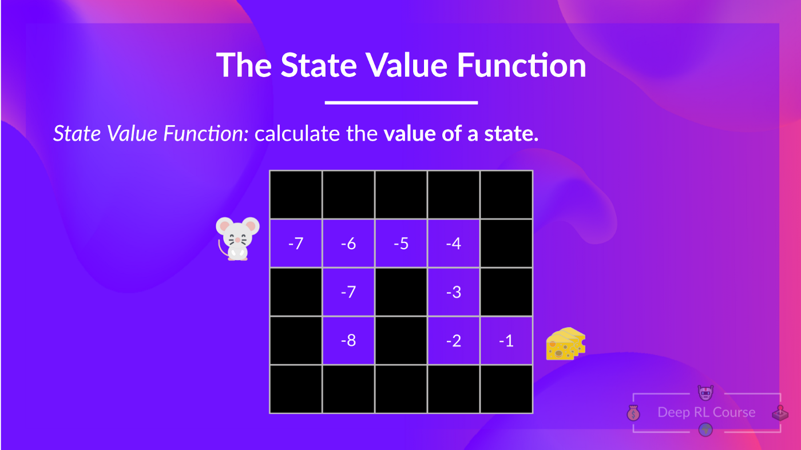

### **What is RL?**

In RL, we build an agent that can make smart decisions, like an agent that learns to play a video game, or training an agent that learns to maximize its benefits by deciding on what stocks to buy and when to sell.

Agent learns from the environment by interacting with it through trial and error and receiving rewards as unique feedback.

The goal is to maximize its expected cumulative reward. The agent's decision making process is called the policy : $\pi$

Goal is to find an **optimal policy**. There are two methods to that:

1. Policy Based : Train the policy directly to learn which action to take given a state.

2. Value Based : Train a value function to learn which state is more valuable, and use this value function to take the action that leads to it.

#### **Value-Based Method**

We learn a value function that maps a state to the expected value of being at that state.

Indirectly by training a value function that outputs the value of a state or a state-action pair.

#### **Policy-Based Method**

The policy takes a state as input and outputs what action to take at that state. 

---

Whichever method we end up using, we will have a policy. 
- In policy-based training, the optimal policy is found by training the policy directly.
- In value-based training, finding an optimal value function leads to having an optimal policy.

In value-based method, we will see an **Epsilon-Greedy Policy**, that handles the exploration/exploitation trade-off.

--- 

**The State-value function**

We write the state value function under a policy $\pi$ like this:

For each state, the state-value function outputs the expected return if the agents start at that state and then follows the policy forever afterward.

**The action-value function**

